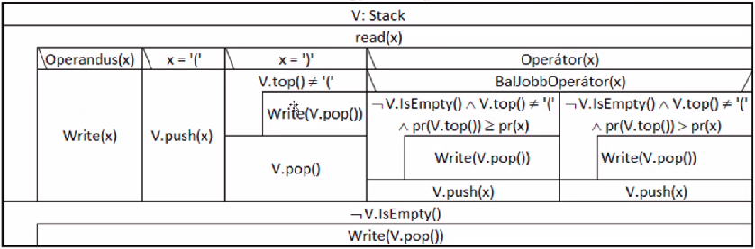

##Reverse-polish
Converts infix formulas to reverse polish notation (postfix format), algorithm is based on the following diagram:


To compile, open the Code::Blocks project file, or use `make` (Makefile is also included):
```
$ make
$ ./reverse-polish
```
To delete binary issue `make clean`
This code uses `Stack.h` from the stack folder.   
 
